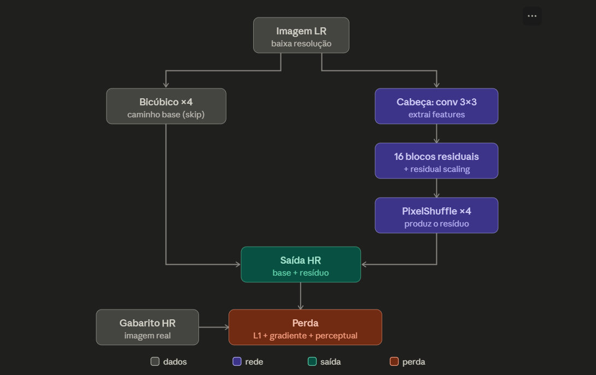
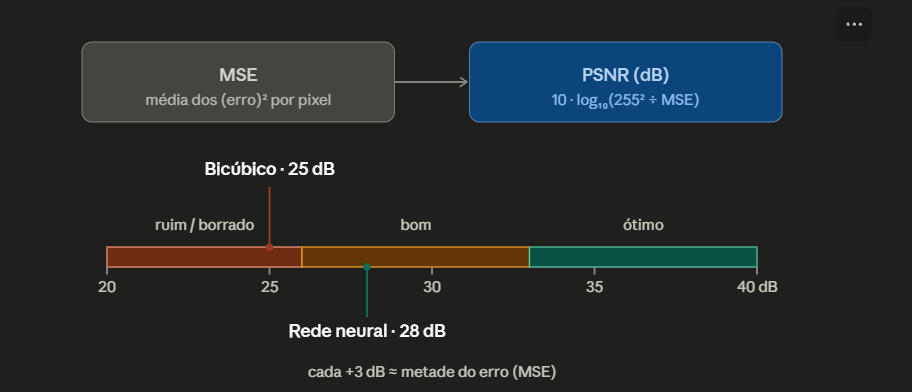

# Deep Learning para Monte Carlo Path Tracing

Implementação prática dos pilares do survey **_"A Survey on Deep Learning for Monte Carlo Path Tracing"_** (Yan et al., ACM Computing Surveys, 2025): um **denoiser** (KPCN / Direct Prediction) e um **upsampler** espacial (EDSR-lite), treinados em dados reais.

> Projeto de disciplina — Mestrado em Ciência da Computação, UFBA (Tópicos em Computação Visual II).

---

## Ideia em uma frase

Monte Carlo path tracing é fisicamente correto, mas o ruído da estimativa cai devagar (na ordem de `O(1/√N)`), então gerar uma imagem limpa exige milhares de amostras por pixel e muito tempo. O deep learning ataca esse custo por três frentes; aqui reproduzimos duas:

| Pilar | O que faz | Script | Dataset | Seção do survey |
|-------|-----------|--------|---------|-----------------|
| **Denoising** | limpa uma imagem ruidosa de baixo spp | `mc_denoiser.py` | (sintético) | Seção 3 |
| **Denoising (dados reais)** | treina o denoiser em cenas reais | `treina_noisebase.py` | **NOISEBASE** | Seção 3 |
| **Upsampling** | renderiza pequeno e amplia 4× | `div2k_local_v2.py` | **DIV2K** | Seção 4 |

---

## Estrutura do repositório

```
.
├── mc_denoiser.py         # denoiser: Direct Prediction (Eq. 8) e KPCN (Eqs. 9-10)
├── treina_noisebase.py    # treina o KPCN em dados reais (NOISEBASE) + demodulação + SMAPE
├── div2k_local_v2.py      # upsampler 4x (EDSR-lite) com perdas L1 + gradiente + perceptual
├── image.png              # amostras do NOISEBASE (dataset do denoiser)
├── image-1.png            # arquitetura do upsampler
├── image-2.png            # ilustração da métrica PSNR
└── README.md
```

`treina_noisebase.py` **importa** o denoiser de `mc_denoiser.py`, então os dois precisam ficar na mesma pasta.

---

## Datasets

O projeto usa **dois datasets diferentes**, um para cada pilar. Entender de onde vêm os dados é metade do trabalho.

### NOISEBASE — o dataset do **denoiser**

`treina_noisebase.py` · [Manual](https://balint.io/noisebase/manual.html)

O NOISEBASE é uma base de cenas renderizadas por **Monte Carlo path tracing**, feita justamente para treinar denoisers. O diferencial é que ele não entrega só a imagem final: para cada pixel ele fornece as **amostras individuais** e os **buffers auxiliares** que a rede precisa:

- `color` — a imagem **ruidosa** em baixo spp (a entrada a ser limpa);
- `diffuse` — o **albedo** (cor base do material), usado como G-buffer e na demodulação;
- `normal` — a direção da superfície (G-buffer);
- `depth` — a distância à câmera (G-buffer);
- `reference` — o render **limpo** em alto spp (o gabarito / alvo `c_p`).

Cada sequência tem **64 frames** a resolução 1080p e até **32 amostras por pixel**; usamos poucas cenas (~2–9 GB cada) e um número baixo de amostras (`SAMPLES=8`) para gerar entradas bem ruidosas. É o dataset do **NPPD** (Balint et al.), o método de *sample space* citado no próprio survey — ou seja, treinamos com dados de um dos papers da área.

A grade abaixo mostra recortes reais do NOISEBASE (dá para ver o **grão do ruído MC** e alguns **fireflies** — os pontos brancos estourados que o denoiser precisa domar):


### DIV2K — o dataset do **upscaling**

`div2k_local_v2.py` · [Kaggle](https://www.kaggle.com/datasets/soumikrakshit/div2k-high-resolution-images?resource=download-directory)

O DIV2K é um conjunto de **1000 imagens RGB de alta resolução** e conteúdo bem diverso, muito usado como referência para modelos de super-resolução. Ele é dividido em **800 imagens de treino**, **100 de validação** e **100 de teste**. Nesta cópia do Kaggle vêm apenas as imagens em **alta** resolução; as versões de baixa resolução não são fornecidas.

Por isso, no nosso script as imagens de baixa resolução (LR) são **geradas em tempo de execução**: cada recorte de alta resolução é reduzido 4× por interpolação bicúbica, formando o par `(LR → HR)` que a rede aprende a inverter.

> **Observação honesta (importante para a banca):** como a LR é criada **reduzindo** uma foto, este demo é, tecnicamente, **super-resolução de foto** (o problema de *desborrar*), e **não** o upsampling de renderização real, que é *antialiasing* + *motion vectors*. O código ilustra a **mecânica** (rede, perdas, EDSR); o caso renderizado exigiria dados com G-buffers e motion vectors.

---

## Fundamentação: do problema aos scripts

O objeto central é a **equação de renderização**, resolvida por Monte Carlo. Como o erro do estimador diminui apenas com `O(1/√N)` (para reduzir o ruído pela metade é preciso **4×** mais amostras), atacar esse muro é o objetivo de todos os métodos. Os scripts abaixo são a materialização direta das equações do survey.

### 1. `mc_denoiser.py` — o coração teórico (Seção 3)

Implementa as duas arquiteturas de denoising e, na prática, as Equações 7 a 10:

- **Equação 7** (treino supervisionado): ajusta os pesos `θ` da rede `g` para minimizar a perda `ℓ` entre a saída e a referência limpa.
- **Entrada `X_p`** (10 canais): imagem ruidosa (3) + as *auxiliary features* / G-buffers **albedo** (3), **normal** (3) e **depth** (1). Vindas limpas da geometria, dizem à rede **onde não borrar** (bordas de objetos).
- **Direct Prediction (Eq. 8):** a rede produz a cor diretamente. Mais poderosa, menos estável (abordagem de OptiX/OIDN).
- **Kernel Prediction / KPCN (Eqs. 9–10, Bako et al. 2017):** a rede prevê pesos, uma **softmax** os normaliza (Eq. 9) e a cor é a **média ponderada** dos vizinhos (Eq. 10). A saída fica no *convex hull* da vizinhança → treino mais estável.

O backbone das duas variantes é uma **U-Net** (encoder que comprime e "enxerga longe" para juntar vizinhos + decoder com *skip connections* que devolvem os detalhes finos). Só muda a **cabeça de saída**: 3 canais (a cor) na Direct, `k·k` canais (os pesos do kernel) na Kernel Prediction.

**Rodar (teste de ponta a ponta com dados sintéticos, sem renderizador):**

```bash
pip install torch numpy
python mc_denoiser.py
```

Gera 16 cenas falsas (com ruído de **Poisson**, que imita o ruído MC), treina o KPCN por poucas épocas e roda a inferência — útil para validar o pipeline em qualquer máquina.

### 2. `treina_noisebase.py` — a teoria em dados reais (Seção 3)

Treina o `KernelPredictionDenoiser` nas cenas do **NOISEBASE**. Dois pontos de destaque:

- **Demodulação por albedo** (Chaitanya et al. / NPPD, Sec. 3.1.1): divide a radiância pelo albedo *antes* de filtrar (removendo a textura nítida e deixando só a iluminação suave, mais fácil de limpar) e multiplica de volta depois. **Não** é o *split* difuso/especular do Bako — esse exigiria radiâncias separadas que o NOISEBASE não fornece.
- **Perda SMAPE** (erro relativo simétrico, usada por Vogels/NPPD): mais robusta a *fireflies* e melhor para HDR que a L1, pois equilibra regiões claras e escuras.

**Pré-requisitos e execução:**

```bash
pip install torch noisebase pillow "zarr<3"
#                                   ^ o noisebase quebra com zarr 3.x
# edite as constantes no topo do arquivo (PASTA, CENAS) e rode:
python treina_noisebase.py
```

> **Disco:** cada cena tem ~2–9 GB. Deixe a pasta de dados **fora do OneDrive**.

### 3. `div2k_local_v2.py` — upsampling espacial (Seção 4)

Upsampler 4× no estilo **EDSR**: o bicúbico serve de **caminho base** (o "chute burro") e a rede aprende apenas o **resíduo** — o detalhe que falta. A cabeça extrai features, 16 blocos residuais (com *residual scaling*) processam, o `PixelShuffle` aumenta a resolução de forma aprendida (com inicialização **ICNR** para evitar o artefato de tabuleiro), e a saída é `base + resíduo`. O fluxo completo:



O ponto central é a **perda combinada**, que resolve o borrão:

```
perda = L1  +  W_GRAD · perda_de_gradiente  +  W_PERCEPTUAL · perda_perceptual(VGG)
```

A L1 sozinha puxa a saída para a média (imagem borrada); os termos de **gradiente** (bordas) e **perceptual** (textura, via VGG) recompensam o detalhe. Os pesos controlam o **trade-off nitidez × estabilidade**.

**Rodar:**

```bash
pip install torch torchvision numpy pillow matplotlib
pip install scikit-image   # opcional: habilita o SSIM
# edite TRAIN_DIR / VALID_DIR no topo e rode:
python div2k_local_v2.py
```

---

## Métricas de avaliação

As comparações reportam duas métricas complementares, sempre medidas num **recorte de maior detalhe** (onde a diferença entre métodos realmente aparece; numa parede lisa, rede e baseline empatam).

### PSNR (Peak Signal-to-Noise Ratio)

"Relação sinal-ruído de pico". É a forma mais simples de medir o quanto a imagem está parecida com o gabarito, em dois passos: primeiro calcula o **erro médio quadrático (MSE)** entre os pixels, depois converte esse erro para **decibéis (dB)** numa escala logarítmica. Quanto **maior** o dB, melhor — e cada **+3 dB** corresponde, grosso modo, a **metade do erro (MSE)**.



O PSNR tem uma fraqueza: ele olha **pixel por pixel, isolado**. Dois erros bem diferentes para o olho humano (um borrão suave vs. um deslocamento de brilho) podem dar o mesmo PSNR. É aí que entra o SSIM.

### SSIM (Structural Similarity Index)

"Índice de similaridade estrutural". Em vez de comparar pixels isolados, compara **padrões em pequenas janelas deslizantes**, combinando três fatores: **luminância** (`l` — o brilho médio bate?), **contraste** (`c` — a variação de intensidade bate?) e **estrutura** (`s` — o padrão de bordas e texturas bate?). O valor final é `SSIM = l · c · s`, de **0 a 1**, onde **1 = idêntico**. Como pesa a estrutura, costuma combinar muito melhor com o que o olho percebe como "parecido".

---

## Mapa teoria → código (referência rápida)

| Conceito do survey | Onde aparece no código |
|--------------------|------------------------|
| Equação 7 (treino supervisionado) | laço `train(...)` → `loss = ℓ(pred, alvo)` + `.backward()` |
| Entrada `X_p` (ruidoso + G-buffers) | `net_in = torch.cat([noisy_log, albedo, normal, depth])` |
| Equação 8 (Direct Prediction) | `DirectPredictionDenoiser` |
| Equação 9 (softmax dos pesos) | `weights = F.softmax(logits, dim=1)` |
| Equação 10 (média ponderada) | `(patches * weights).sum(dim=2)` |
| Tratamento HDR | `torch.log1p(...)` / `torch.expm1(...)` |
| Demodulação por albedo (Chaitanya) | `noisy / (albedo + EPS)` → `remodular(...)` |
| Perda HDR relativa (SMAPE) | `denoising_loss(...)` em `treina_noisebase.py` |
| Pixel space (média das amostras) | `media_amostras(...)` (`.mean(dim=-1)`) |
| Trade-off nitidez × estabilidade | `L1 + W_GRAD·grad_loss + W_PERCEPTUAL·perceptual` |

---

## Referência

Yan, R., Guo, H., Huang, L., Xiao, N., Li, S., Wang, Y., Lv, Y., & Chen, G. (2025). *A Survey on Deep Learning for Monte Carlo Path Tracing*. **ACM Computing Surveys**, 58(4), Article 101. https://doi.org/10.1145/3768618